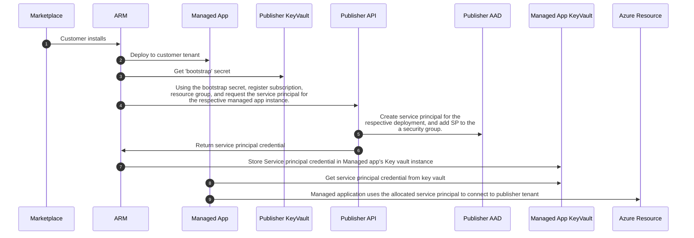
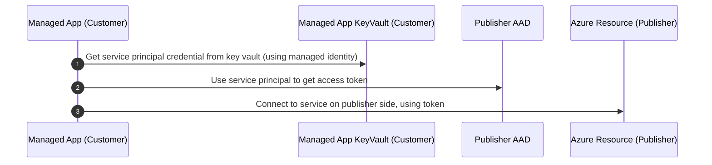
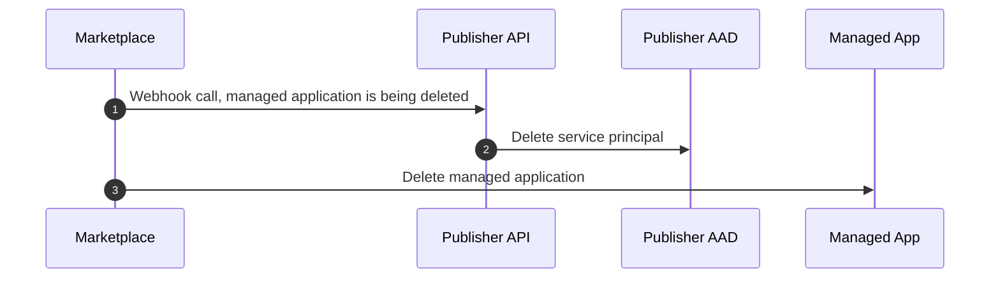

# Introduction

Having an Azure marketplace solution, a publisher might want to share Azure resources from the publisher tenant with the individual customer deployments. Shared resources reduce cost and optimize operations.

This sample shows how to create a managed application, which during installation, can register with a publisher backend, to receive credentials allowing access to allowed Azure services at the publisher side. Credentials are exchanged and store safely during managed application installation.

Scenarios where managed applications benefit from calling (shared) services on the publisher tenant are amongst

- Emitting usage data from the managed application to an Event Hub of the publisher
- Sending telemetry and other data to the publisher 
- Managed application calling APIs on the publisher side

Key to the the setup experience needs to be seamless, for the customer. 
Having this requirement means, that setting up the managed application needs to automatically register with the publisher backend to setup a trust relationship automatically with the publisher.  

For setup and installation, check the [scripts and guide](docs/Installation.md).

### Main application flow, a managed application that registers with the publisher

The setup flow is the entire orchestration, the central part of the sample. An Azure Marketplace deployment calls the publisher to setup the trust relationship. A service principle is created and stored in the key vault of the managed application deployment.



These a few central pieces to registering with the publisher:

* (3,4) ARM deployments can [fetch secrets from a Key Vault](https://docs.microsoft.com/en-us/azure/azure-resource-manager/templates/key-vault-parameter), provided the subscription id, resource group and key vault name. Key Vault needs to be [enabled for ARM deployments](https://docs.microsoft.com/en-us/azure/azure-resource-manager/managed-applications/key-vault-access).
* (5) Publisher API/Backend needs to be configured, ensuring that the created service principals shared with the managed application are added to a security group (or assigned privileges directly), which have the appropriate Azure role assignments (least priveledge).
* (7) Service principal credentials issued by the publisher are stored in the key vault of the managed app.
* (8,9) See 'Usage' below. 

### Usage

When a managed application or Azure marketplace app has registered with the publisher and received the service principal credentials, the managed app can pull the credentials from the key vault in the managed resource group.  



* (1) Fetching the client credentials [from Key Vault using the managed identity]([Azure Key Vault configuration provider in ASP.NET Core | Microsoft Docs](https://docs.microsoft.com/en-us/aspnet/core/security/key-vault-configuration?view=aspnetcore-6.0)).
* (2,3) is standard [OAuth client credentials flow](https://docs.microsoft.com/en-us/azure/active-directory/develop/v2-oauth2-client-creds-grant-flow).

### Managed application lifecycle event

Lifecycle events are emitted for managed applications and marketplace deployed applications when lifecycle changes happens (eg application deleted or provisioned). Its possible to [subscribe to lifecycle events](https://docs.microsoft.com/en-us/azure/azure-resource-manager/managed-applications/publish-notifications) to the events. [Lifecycle events](https://docs.microsoft.com/en-us/azure/azure-resource-manager/managed-applications/publish-notifications#event-triggers) are send to the endpoint specified by the publisher.  

#### Deprovision

For this sample, the most interesting event are when an application is being deprovisioned. 
When a marketplace or managed application is deprovisioned/deleted, the publisher might want to cleanup. In this case, the service principal is deleted. 



Above deprovision is the same for a managed application deployment. 

##### Subscribing to lifecycle event

When specifying the 'Notification Endpoint URL on either the [Service catalog managed application definition](https://docs.microsoft.com/en-us/azure/azure-resource-manager/managed-applications/publish-notifications#add-service-catalog-application-definition-notifications) or in the [Azure Marketplace package details](https://docs.microsoft.com/en-us/azure/azure-resource-manager/managed-applications/publish-notifications#add-azure-marketplace-managed-application-notifications), the URL used in the sample is ```https://endpoint.com?sig=xxxx```, the sample payloads specifies that subscriber needs expose endpoint accepting `POST /resource?sig=xxx`.  


> **_NOTE:_**  Do not add 'resource' to the uri, when specifying the 'Notification Endpoint URL'.  Else notifications will not be processed by the backend.

Signature is stored in the Key Vault as the secret `NotificationSecret`. Get the value from key vault and use that in the `sig` parameter.

Notifications are send at least once and there will be [retries for 10 hours](https://docs.microsoft.com/en-us/azure/azure-resource-manager/managed-applications/publish-notifications#notification-retries) should the publisher endpoint be unavailable.

