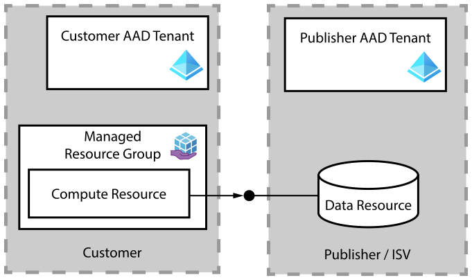

# Using the "Shared Resource Broker" to enable secure cross-tenant data-plane access in managed apps

> When publishing a "managed application" into Azure Marketplace, ISVs sometimes would like to expose central resources to these managed applications. These central resources could be various Azure services running in the ISV's backend, such as Azure storage accounts or other backend infrastructure. This article describes how to securely enable that access.

## Scenario

An Azure Managed Application is an Azure Marketplace offer which is deployed into the customer's Azure subscription when purchased. Azure Marketplace encourages ISVs (also called 'publishers' in this article) to upload their application in a self-contained [deployment package](https://learn.microsoft.com/en-us/azure/marketplace/plan-azure-app-managed-app#deployment-package). However, sometimes, the running managed application might have to access resources on the ISV side, to function properly. 

Examples could be

- reading private Docker images from the ISV's Azure Container Registry
- downloading data files from the ISV's Azure Storage Account
- ingesting metering information about software usage into an Azure Event Hub instance on the ISV side.

In all of these examples, the workload (running in the customer's Azure subscription) has to access a (data plane) service in the ISV's Azure subscription. Such a data-plane access however is not only across subscription boundaries, but also across Azure AD Tenant boundaries (code running on compute in the customer's AAD tenant, accessing API's hosted in the publisher's AAD tenant).



## Bad practice - Embedding the credential in deployment packages

One way how ISVs solved this problem in the past is to embed a credential (service principal, or connection string) in the deployment package, which is uploaded to Partner Center, to be published in Azure Marketplace. 

The managed app deployment then usually has to store the credential in a KeyVault within the managed resource group:


This practice of a single shared credential, stored in the deployment package, is simple to get started, but has serious disadvantages:

**Every caller looks the same:** All managed application deployments (originating from the same deployment package) use the same ISV credential. From the perspective of the data resource, all these customer deployments look like the same principal accessing the resources, i.e. in service audit logs, it would not be possible to differentiate where a call is coming from. 

**High effort for rotation:** If this credential would be compromised, for example by a vulnerability in the managed app implementation, the ISV must change (rotate) the credential, by both updating the deployment package in marketplace (which can be a lengthy process), and all running managed app deployments. The same effort is necessary in case of rotation due to an expiring credential.

## Slightly less worse practice - Host the credential in a publisher Key Vault

Azure Managed applications offer a secure way to expose secrets from the ISV towards a managed application (during deployment), as documented in the article ["Use Azure Key Vault when deploying Managed Applications"](https://learn.microsoft.com/en-us/azure/azure-resource-manager/managed-applications/key-vault-access). For that to work, the ISV must grant the `Appliance Resource Provider` service principal the Contributor permissions on the KeyVault. 

The object ID of that service principal can be retrieved by running the following command:

```azcli
az ad sp list --display-name "Appliance Resource Provider" | jq -r .[0].id
```

In some tenants, that service principal might not yet exist. In these cases, it can be 'installed' by registering the `Microsoft.Solutions` resource provider, like so:

```shell
az provider register --namespace "Microsoft.Solutions"
```

After having the `applianceResourceProviderObjectID`, you can create an ISV-side Key Vault using a Bicep template like this:

```bicep
@description('Specifies the Azure location where the resources should be created.')
param location string = resourceGroup().location

@description('The object ID from the Appliance Resource Provider')
param applianceResourceProviderObjectID string

@description('The KeyVault name')
param keyVaultName string

var roles = {
  Contributor: 'b24988ac-6180-42a0-ab88-20f7382dd24c'
}

resource publisherKeyVault 'Microsoft.KeyVault/vaults@2021-11-01-preview' = {
  name: keyVaultName
  location: location
  properties: {
    enabledForTemplateDeployment: true
    enableRbacAuthorization: true
    tenantId: subscription().tenantId
    sku: { name: 'standard', family: 'A' }
  }
}

resource applianceResourceProviderCanReadSecrets 'Microsoft.Authorization/roleAssignments@2020-10-01-preview' = {
  name: guid(roles.Contributor, 'Appliance Resource Provider', applianceResourceProviderObjectID, publisherKeyVault.id)
  scope: publisherKeyVault
  properties: {
    roleDefinitionId: subscriptionResourceId('Microsoft.Authorization/roleDefinitions', roles.Contributor)
    principalId: applianceResourceProviderObjectID
    principalType: 'ServicePrincipal'
  }
}
```

The ARM deployment in the managed application [fetches a 'bootstrap' secret from the publisher's Key Vault](https://docs.microsoft.com/en-us/azure/azure-resource-manager/templates/key-vault-parameter). The publisher's Key Vault needs to be [enabled for ARM deployments](https://docs.microsoft.com/en-us/azure/azure-resource-manager/managed-applications/key-vault-access). Storing the bootstrap secret in the publisher's KeyVault avoid having a secret in the managed app's ZIP file in marketplace.


